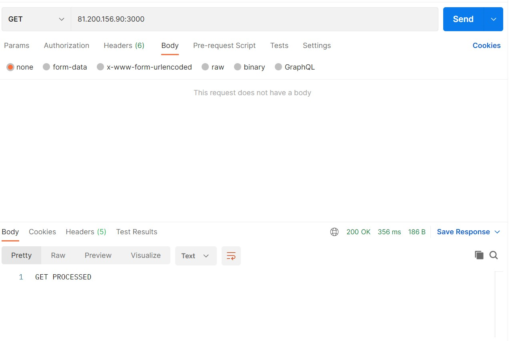
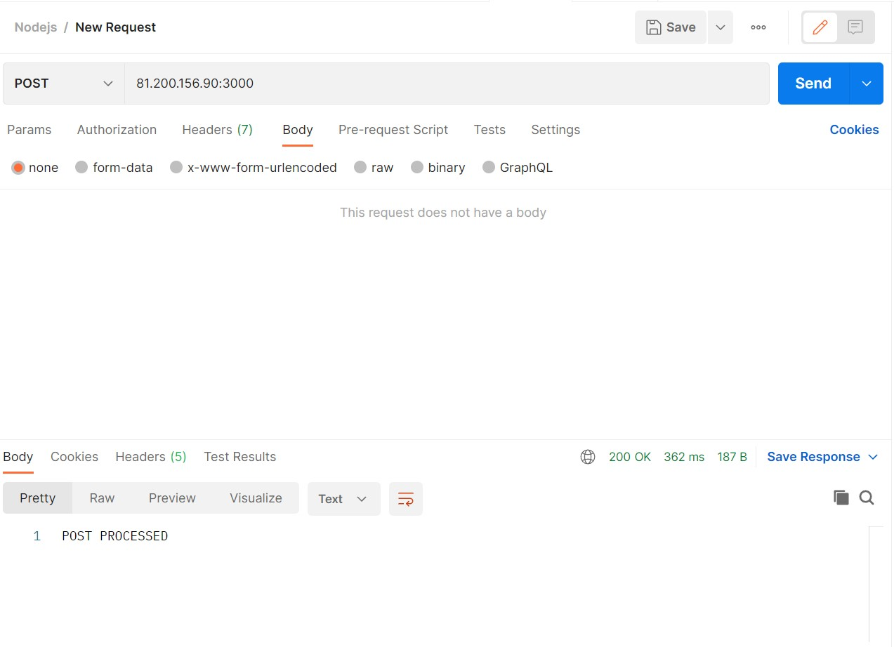
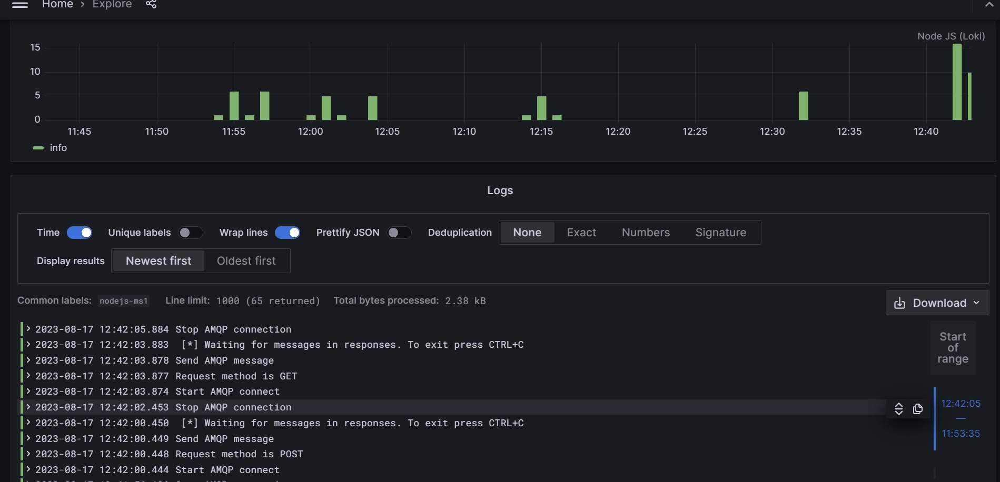

# test-task-nodejs
NodeJs and RabbitMQ test task. 

This app simply accepts any http request on port 3000,
takes its method, and puts it in the queue. 

Second microservice consumes it, and adds "PROCESSED"
to the method, and sents it back.

How to run:

Instruction for Ubuntu OS
0. Clone repo: `git clone https://github.com/Ziucay/test-task-nodejs.git`
1. Install docker: https://docs.docker.com/engine/install/ubuntu/
2. Install docker-compose: https://www.digitalocean.com/community/tutorials/how-to-install-and-use-docker-compose-on-ubuntu-20-04
3. `docker-compose up --build`

## Screenshots

These are examples of requests

And this is the screenshot from Grafana.
It works on port 3101

